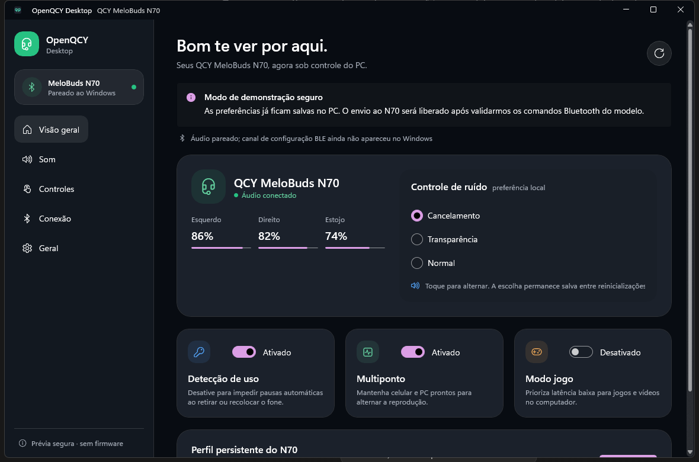
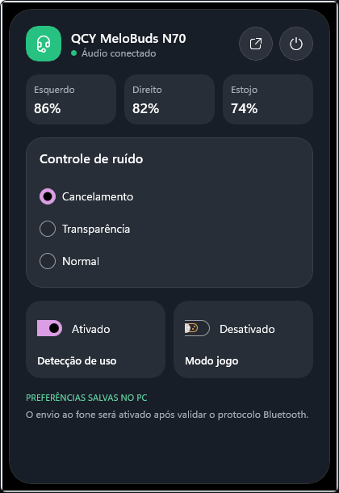

# OpenQCY Desktop

[](https://github.com/GiorgioRafael/OpenQCY-Desktop/actions/workflows/build.yml)
[](https://github.com/GiorgioRafael/OpenQCY-Desktop/releases/latest)
[](LICENSE)

## Download

[](https://github.com/GiorgioRafael/OpenQCY-Desktop/releases/latest/download/OpenQCY-Desktop-Setup.exe)

Baixe e execute `OpenQCY-Desktop-Setup.exe`. O instalador é autocontido, instala somente para o usuário atual e não exige o runtime do .NET nem acesso de administrador.

[ZIP portátil](https://github.com/GiorgioRafael/OpenQCY-Desktop/releases/latest/download/OpenQCY-Desktop-win-x64.zip) · [Todas as versões](https://github.com/GiorgioRafael/OpenQCY-Desktop/releases)

> [!NOTE]
> As compilações comunitárias ainda não são assinadas. O Windows pode exibir "Editor desconhecido" ou um aviso do Microsoft Defender SmartScreen. Confira o download com o arquivo `SHA256SUMS.txt` da versão.

OpenQCY Desktop é um controlador open source para fones QCY no Windows. O primeiro modelo suportado é o **QCY MeloBuds N70 (HT18)**.

> [!IMPORTANT]
> Este é um projeto comunitário independente, sem afiliação, endosso ou suporte da QCY ou da Dongguan Hele Electronics Co., Ltd. QCY e MeloBuds são marcas de seus respectivos proprietários.

## Estado do projeto

O OpenQCY Desktop já possui uma implementação real para o QCY MeloBuds N70. Em 3 de agosto de 2026, o aplicativo foi validado no Windows com o vendor ID `23877` e o firmware `L 3.0.13 · R 3.0.13`:

- descoberta BLE ativa pelos dados do fabricante QCY (`0x521C`)
- conexão ao serviço `A001` e respostas por notificações
- leitura real do firmware e das baterias esquerda, direita e do estojo
- reconexão automática pelo endereço de controle salvo localmente, pelo serviço GATT em cache ou pelo próximo anúncio do N70
- inicialização opcional com o Windows, em segundo plano somente pela área de notificação
- interfaces da janela principal e da área de notificação em inglês
- leitura de ANC, modo jogo, modo sono, LDAC, multiponto, vento, volume dos avisos e desligamento automático
- detecção de uso ligada e desligada pela interface do PC, com confirmação lida do fone
- perfil local reaplicado quando o N70 reconecta





Controles cotidianos implementados:

- Bateria dos lados esquerdo e direito e do estojo
- ANC, transparência, modo normal e os cinco modos reais do N70 (adaptativo, ambiente interno, deslocamento, ambiente ruidoso e anti-vento)
- Presets e curva personalizada de múltiplas bandas
- Personalização dos gestos de toque
- Detecção de uso com reaplicação automática ao reconectar
- LDAC, multiponto, modo jogo, modo sono e redução de vento
- Volume dos avisos e desligamento automático

O firmware testado expõe diretamente os gestos e aceita o comando de EQ paramétrico, mas não expõe a característica antiga de presets `0000000B`. Por isso, o OpenQCY libera a curva personalizada de dez bandas e só libera a troca direta de presets quando o firmware realmente oferecer esse canal. Nem todos os comandos foram exercitados em todas as variantes de firmware do N70; capacidades ausentes ficam desativadas, sem envio de bytes presumidos.

Atualização de firmware, conta, telemetria, anúncios e loja estão explicitamente fora do escopo.

## Tecnologia

- C# 14 e .NET 10 LTS
- WinUI 3 / Windows App SDK
- APIs Bluetooth GATT do Windows
- MVVM com CommunityToolkit.Mvvm
- Instalador e distribuição portátil autocontidos para Windows 11

A identidade visual se chama **OpenQCY Glass**: uma interpretação nativa do Windows da clareza, profundidade, cantos amplos e expansão contextual das interfaces modernas da Apple. Ela usa controles WinUI nativos e recursos originais do projeto; não distribui fontes, ícones ou imagens da Apple.

## Compilação

Pré-requisitos:

- Windows 11
- SDK do .NET 10
- Inno Setup 6.7 ou posterior (somente para criar o instalador localmente)

```powershell
dotnet restore -r win-x64
dotnet build -c Debug -p:Platform=x64 -p:RuntimeIdentifier=win-x64
dotnet run -c Debug -p:Platform=x64 -p:RuntimeIdentifier=win-x64
dotnet test tests/OpenQCY.Desktop.Tests.csproj -c Release
pwsh ./scripts/build-installer.ps1 -Version 0.2.0
```

O GitHub Actions gera as duas distribuições. Enviar uma tag semântica como `v0.2.0` publica o instalador, o ZIP portátil e os checksums no GitHub Releases. Consulte o [guia de lançamento](docs/releasing.md), a [arquitetura](docs/architecture.md), a [pesquisa do protocolo](docs/protocol-research.md) e a [linha de base de desempenho](docs/performance.md).

## Segurança

O OpenQCY Desktop nunca tenta adivinhar nem testar comandos por força bruta. Um comando precisa ter evidência pública de interoperabilidade ou uma captura anonimizada de hardware pertencente ao usuário, testes determinísticos e confirmação por leitura antes de ser liberado. Consulte a evidência exata em [pesquisa do protocolo](docs/protocol-research.md).

## Licença

[MIT](LICENSE)
